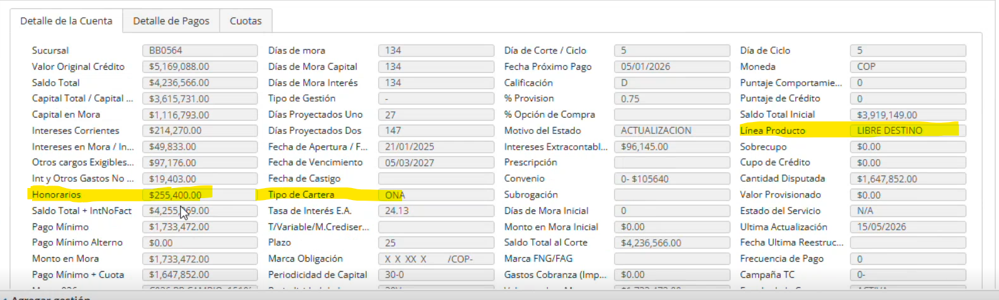

# pago mora

Campos que se nesecitan para honorarios de ICS

1) Linea de Producto:  Para saber la linea del producto y saber que % usar para sacar cada honorarios
2) Honorarios:  Si tiene honorarios se le resta estos honorarios al pago minimo

           Formualas

Calculos =  Restar del pago minimo los honorarios que trae la data
(el resultado seria el nuevo pago minimo)

Calculo 2 = (abono minimo * el tipo de producto CONSUMO
COMERCIAL VEHICULO) / 100

El resultado son los honorarios a cobrar

Campos:
LineaPagoM
Antes de esto tener un switch poder saber si se va aplicar honorarios o no , Los campos que se necesitan seria que eligir la linea del produto (lista desplegable) y el tipo de cartera (lista desplegable )para poder aplicar el campo de los hornorios y aplicar el porcentaje de los honorarios

Valor Honorarios Maximo = 993c55c0-8b02-4be9-a122-d7ec2cf5f87e
Honorarios cofirm  = ae33bcc4-183a-47de-a6c8-f4ecc44be169
linea = 9ccfa8bd-4060-4aa1-b437-4528d6f9bc35
tipo de cartera = 6e51a18a-184d-455f-9f42-6b3a3d56729f
dias mora = 247db41e-ea0d-444b-b3d0-627aae51ecd0

¿aplica honoraios o gastos de cobranza?
default : no aplica
Lista: boton de honorarios cambiar pors lista
No aplica
Gastos cobranza
honorarios

Tipo de linea // setear tarjeta automaticamente en el campo de linea si trae una tarjeta
cambiar label Abono Max Honorarios
por Valor Honorarios Maximo

No aplica,GxC,Honorarios
¿Honorarios o GxC?
HonorariosOgxc

# Cancelacion

id lista desplegable = bda37ca7-d503-4d41-8ff4-aebde2cb7c30
Valor Honorarios Maximo = 9ee8ee24-5ae5-42da-83c5-36948592e72b
Honorarios cofirm = a0a2b9b0-17cc-41fe-be98-2ac2157e33ef
Pago mínimo * = aa665762-9b2f-47f8-8d8c-cabca1924771
Tipo linea = 8e8d6cf2-299c-4b45-8059-64cf50b2bd11
Tipo cartera = dfe46e30-5328-485e-bc80-bec20aab2d02
dias mora = 27cfef98-5ca4-415e-8149-7149479d487a
 pago minimo descontar isc honorarios =  comparar con snr  y multiplicar el menor con la cartera
 y
 saldo total - honorarios  

 BaseHonorarios = MIN(PagoMinimoBase, SNR)

Honorarios = BaseHonorarios * PorcentajeCartera

# Ampliacion

id lista desplegable = 020563ab-b407-433b-bcf3-c534456818f3
Valor Honorarios Maximo = d647e41b-7a50-46b0-ba5f-e30eeb44b463
Honorarios cofirm = e2a45a6f-d7e5-40ea-813f-cdbee2c58c4b
Tipo linea = 8e1dc11f-e65c-4141-a1d5-42850fd9b214
Tipo cartera = 93f08e21-47c5-48ee-8acc-b093afe84a38
dias mora = 7ba8643d-9438-4ade-bb3f-bab7948e2cbf
Honorarios = snr * PorcentajeCarteras

1053327350

# Aplicacion de honorarios 22,5
