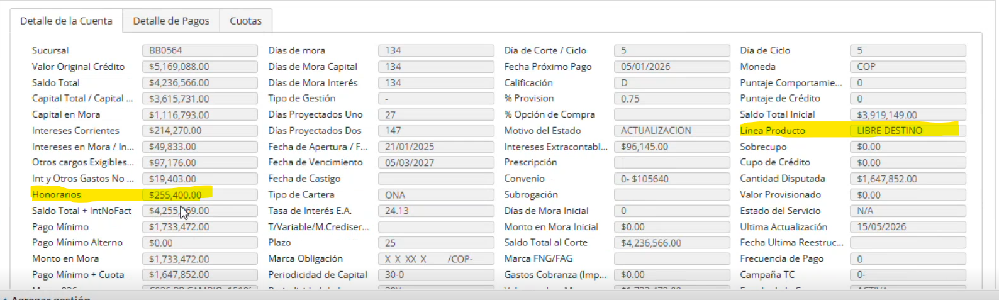

Campos que se nesecitan para honorarios de ICS

1) Linea de Producto:  Para saber la linea del producto y saber que % usar para sacar cada honorarios
2) Honorarios:  Si tiene honorarios se le resta estos honorarios al pago minimo

    |       Formualas

Calculos =  

Antes de esto tener un switch poder saber si se va aplicar honorarios o no , Los campos que se necesitan seria que eligir la linea del produto (lista desplegable) y el tipo de cartera (lista desplegable )para poder aplicar el campo de los hornorios y aplicar el porcentaje de los honorarios

abono max permitido = 993c55c0-8b02-4be9-a122-d7ec2cf5f87e
honorarios = ae33bcc4-183a-47de-a6c8-f4ecc44be169
linea =9ccfa8bd-4060-4aa1-b437-4528d6f9bc35
tipo de cartera = 6e51a18a-184d-455f-9f42-6b3a3d56729f
